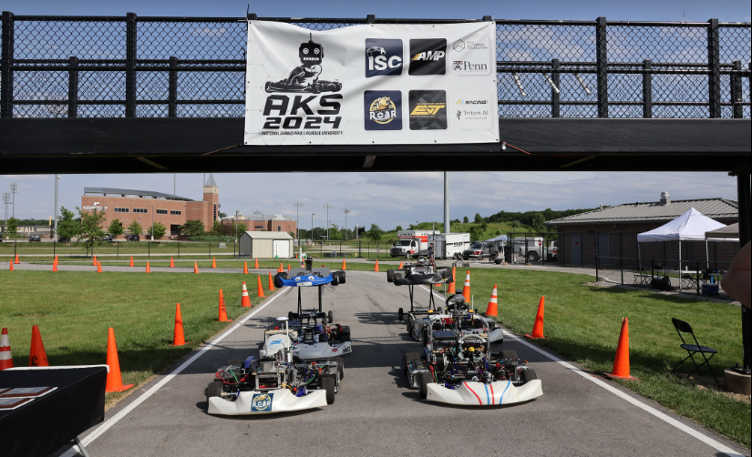
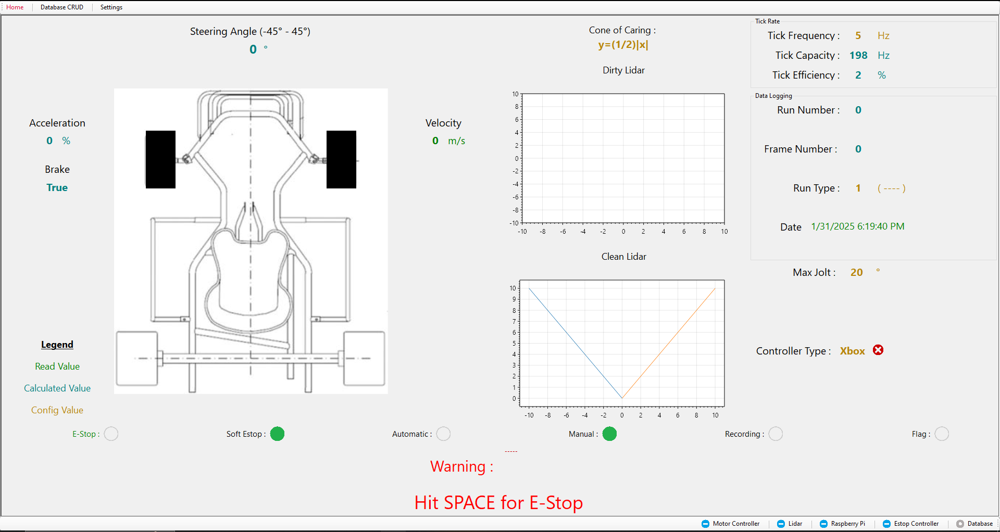

# Autonomous Go-Kart

*This project is still in progress.*  

As part of my **Senior Design Capstone** at Miami University, I’m leading the software development for an **autonomous go-kart**—a self-driving vehicle designed to compete in the **Autonomous Karting Series (AKS)** at Purdue University. This project integrates **embedded systems, machine learning, and real-time control** to create a high-performance autonomous racer.

## Key Features

### Remote Control & Manual Override  
- Operated via a **C# application** for real-time manual control before full autonomy.  

### LiDAR-Based Navigation  
- Uses **LiDAR sensors** and advanced path-planning algorithms to detect obstacles and navigate.  

### Machine Learning for Object Detection  
- **TensorFlow-trained neural network** processes sensor data for real-time decision-making.  

### PostgreSQL Data Logging  
- Stores sensor readings, telemetry, and decisions for **performance analysis and optimization**.  

### Embedded System Optimization  
- **Low-latency control logic** ensures smooth and efficient track performance.  

## Software Application  

The **C# control application** serves as a remote interface and debugging tool, offering:  

✔ **Real-time telemetry visualization** (speed, position, and sensor data)  
✔ **Live video feed integration** for manual monitoring  
✔ **AI-assisted decision logging** for post-race analysis  
✔ **Remote firmware updates** for rapid software improvements  

## Competition & Testing  

Our go-kart will compete in the **Autonomous Karting Series (AKS)** at **Purdue University**, where teams race autonomous vehicles in a high-speed, precision-based competition. **Testing and tuning are ongoing** to ensure peak performance on race day.  
